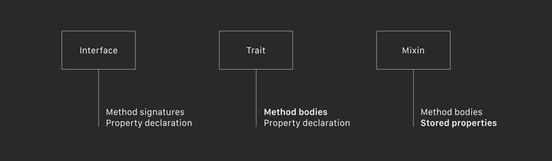
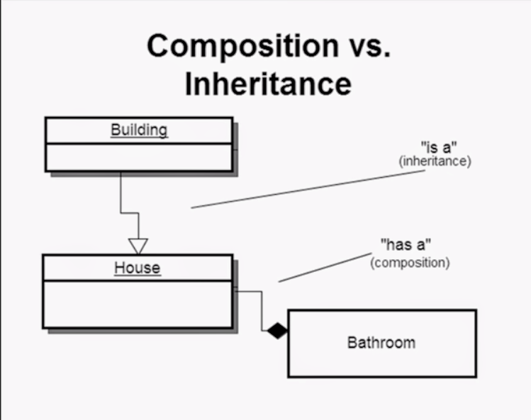

**MDE**(**M**etadata-**D**riven **E**ngine)
is an application engine that aims at implementing **Domain Driven Design** principles to help developers pay more attention to **Business Value**.
It's powered by **MetaData Driven Design** and **Composite Oriental Programming** to supports flexible and extensible architecture.

#### Features:
- COP as fundamental mechanism
- Interface as Metadata
- Composite is assembled at runtime
- Dynamic customization and extension supporting

### Requirements
- JDK 1.8+

### Changes
please check [Changes](CHANGELOG.md) .

### MDE Modules

#### Core
Core module is base layer of MDE that implemented the COP and provided plugin mechanism for extensions. In short, It's a dynamic code assembler using ByteBuddy.
- Path: core
- Features:
  - Composite
  - Mixin
  - Property
  - Behavior
  - Extension
  - Delegate
  - Spring boot integration(core-spring)

#### Entity Engine
Entity engine is a simple extension of Core module to support JDBI integration.
- Path: entity-engine
- Features:
  - Entity
  - Aggregate
  - JdbiMixin
  - Common Mixins
  - Jdbi: SqlObject StringTemplate
  - Spring boot integration(entity-engine-spring)
  - Mustache template engine: [JMustache](https://github.com/samskivert/jmustache)

#### Event Engine
Event Engine implemented event bus based on Guava event-bus that supports sync or async application pub/sub mechanism.
- Path: event-engine
- Features:
  - EventHandlerRoot
  - EventHandler
  - EventMixin
  - SyncPost/AsyncPost
  - Spring Boot integration(event-engine-spring)

#### FSM Engine
FSM Engine extended standard Composite to FSM that support self-auto status transition according to events.
- Path: fsm-engine
- Features:
  - FSM
  - FsmAction
  - FsmTransitionHandler

### FAQ

#### What's the composite?
  Composite in COP just likes Object in OOP. It's an implementation of **Composition over inheritance** principle.
  The Composite of MDE is assembled according to metadata that annotated with **@Composite** on the fly, and the definition of Composite is composed by **Mixins** that presents a code fragment.

#### What's the mixin?
  In object-oriented programming languages, a Mixin is a class that contains methods for use by other classes without having to be the parent class of those other classes. How those other classes gain access to the mixin's methods depends on the language. Mixins are sometimes described as being "included" rather than "inherited".

  Definition:  
  Mixins are a language concept that allows a programmer to inject some code into a class. Mixin programming is a style of software development, in which units of functionality are created in a class and then mixed in with other classes.
  A mixin class acts as the parent class, containing the desired functionality. A subclass can then inherit or simply reuse this functionality, but not as a means of specialization. Typically, the mixin will export the desired functionality to a child class, without creating a rigid, single "is a" relationship. Here lies the important difference between the concepts of mixins and inheritance, in that the child class can still inherit all the features of the parent class, but, the semantics about the child "being a kind of" the parent need not be necessarily applied.

  Advantages:  
  1. It provides a mechanism for multiple inheritance by allowing multiple classes to use the common functionality, but without the complex semantics of multiple inheritance. 
  2. Code reusability: Mixins are useful when a programmer wants to share functionality between different classes. Instead of repeating the same code over and over again, the common functionality can simply be grouped into a mixin and then inherited into each class that requires it. 
  3. Mixins allow inheritance and use of only the desired features from the parent class, not necessarily all of the features from the parent class. 

#### What’s the difference between an interface, a trait and a mixin?
  It’s a bit academic and not everyone agrees on these definitions, but it goes something like this:
  

  > 1. First off we have the interface. This is a protocol that just has method signatures but no actual code. This is what Objective-C and Swift 1.2 have.
  > 2. A trait also has the actual method bodies. In other words, a trait adds code to an interface. This is the new thing that Swift 2.0 lets us do today with protocol extensions.
  > 3. A mixin is like a trait but it also has state. We can’t really do this yet with Swift 2.0 as you’re not allowed to add stored properties to protocols.

#### What's the COP?
  It's **C**omposition **O**riented **P**rogramming. COP allows developers to work with 'fragments', smaller than classes, and 'compose' fragments into larger 'composites' which acts like the regular objects.

  **Composition over inheritance** (or composite reuse principle) in object-oriented programming (OOP) is the principle that classes should achieve polymorphic behavior and code reuse by their composition (by containing instances of other classes that implement the desired functionality) rather than inheritance from a base or parent class.
  

#### What's the Extension?
  An extension presents the customizations and extensions of target composite. The Composite Engine will enhance target composite according to extension definitions at runtime.
  The extension mechanism supports adding new properties/methods and override target's method by @Delegate(**Warning:** don't use append mode when the extension inheriting the delegate source).

#### It sound great, but i'm still a little bit of confused. Show me the code!
    // === OOP style ===
    // Class is a template of Objects, it's the definition.
    class Car {
      String model;
      int cyclinders;
      int displacement;
      int horsepower;
      int torque;
      int weight;
      int length;
      int width;
      int height;
      int speed;

      void ignite() {
        //...
      }

      void run() {
        //...
      }
    }

    class Suv extends Car {
      float approachAngle;
      float depatureAngle;

      void offroad() {
        //...
      }
    }

    // === COP style ===
    // Mixins definition.
    @Mixin
    interface ModelMixin {
      @Property
      String getModel();
      void setModel(String model);

      @Property
      int getLength();
      void setLength(int length);

      @Property
      int getWidth();
      void setWidth();

      @Property
      int getHeight();
      void setHeight();
    }

    @Mixin
    interface EngineMixin {
      @Property
      int getCylinders();
      void setCylinders(int cyclinders);

      @Property
      int getDisplacement();
      void setDisplacement(int displacement);

      @Property
      int getHorsepower();
      void setHorsepower(int horsepower);

      default void ignite() {
        //...
      }
    }

    @Mixin
    interface Runable {
      @Property
      int getSpeed();
      void setSpeed(int speed);

      default void run() {
        //...
      }
    }

    @Mixin
    interface Offroadable {
      @Property
      float getApproachAngle();
      void setApproachAngle(float approachAngle);

      @Property
      float getDepatureAngle();
      void setDepatureAngle(float depatureAngle);

      default void offroad() {
        //...
      }
    }

    @Mixin
    interface Flyable {
      @Property
      int getX();
      void setX(int x);

      @Property
      int getY();
      void setY(int y);

      @Property
      int getZ();
      void setZ(int z);

      default viod fly() {
        //...
      }
    }

    //Composite definition
    @Composite
    interface Car extends ModelMixin, EngineMixin, Runnable {
    }

    @Composite
    interface Suv extends ModelMixin, EngineMixin, Runnable, Offroadable {
    }

    //Extension definition
    @Extension(target=Car.class)
    interface FlyCar extends Car.class, Flyable {
      @Delegate(name = "run", parameterTypes = {})
      default void run(@Self Flyable self) {
        self.fly();
      }
    }

#### The interface only support public members, so what about private members?
  Directly say, no way in JDK 8.0! But JDK 9.0 had been released now that has added "Private methods on interfaces" feature. Still, there're some tricks to help enclose members as private members:

    //Naming methods start with '_' to indicate these are private and should not use outside of the composite.
    //But properties are not suitable as methods, because properties should follow the java bean standard.
    @Composite
    interface Cat {
      @Property
      String getColor();
      void setColor(String color);

      default void _meow() {
        System.out.println("meow...");
      }

      default void playWith(String butterfly) {
        _meow();
        //...
      }
    }

    //Enclose private members in inner classes that only has private constructor methods.
    @Composite
    interface Cat {
      @Property
      Cask getCask();
      void setCask(Cask cask);

      @Initializer
      default void preset() {
        setCask(new Cask());
      }

      default void playWith(String butterfly) {
        getCask().meow();
      }

      class Cask {
        private String color;

        //Change constructor scope to private to prevent createing outside of Cat.
        private Cask(){
        }

        private void meow() {
          System.out.println("meow...");
        }
      }
    }

### Resources
- [Mixins and traits](https://www.ibm.com/developerworks/library/j-jn8/index.html)
- [Effective Java - Item 18: Prefer interface to abstract class](https://books.google.com/books?id=ka2VUBqHiWkC&lpg=PA93&ots=y_DfIjp-M2&dq=java%20mixin&pg=PA93#v=onepage&q&f=false)
- [Introduction to Mixins Understanding Mixin Architecture](https://github.com/SpongePowered/Mixin/wiki/Introduction-to-Mixins---Understanding-Mixin-Architecture)
- [Mixins as alternative to inheritance in Java 8](http://hannesdorfmann.com/android/java-mixins)
- [Java 8: Now You Have Mixins?](https://kerflyn.wordpress.com/2012/07/09/java-8-now-you-have-mixins/)
